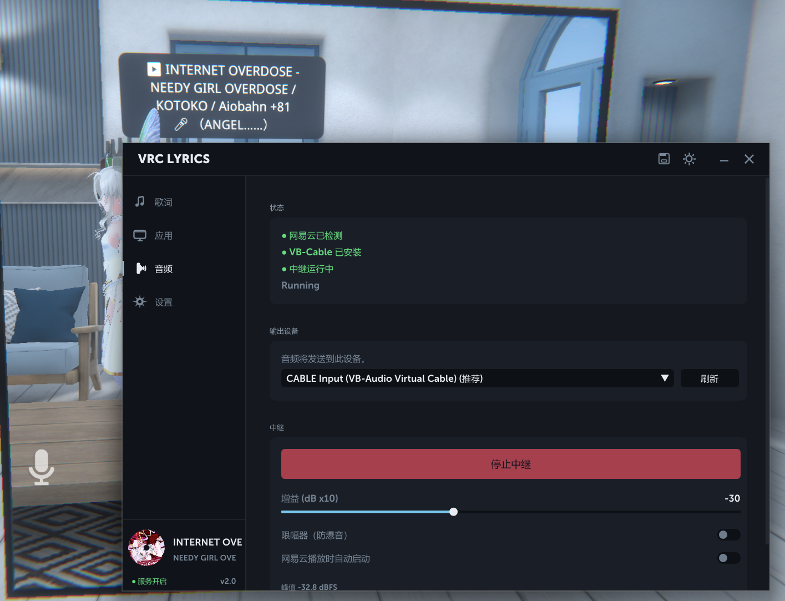

<div align="center">

# VRChat Lyrics

**网易云歌词 → VRChat chatbox 实时推送**
**v2.0:网易云音频 → VRChat 麦克风(进程级 loopback + VB-Cable)**
**v3.0:Bilibili 视频解析直链 + 音频中继音质修复**
**v3.1:Activity 标签升级为状态中心(自定义状态 / AFK / 分类前缀) + 完整 emoji 支持**

C++ + ImGui · 中英繁三语 · 暗亮主题

[](LICENSE)
[]()
[]()

</div>

---

## ✨ 特性

- 🎵 **自动读取网易云正在播放的歌**
  通过 BetterNCM 插件 [inflink-rs](https://github.com/apoint123/inflink-rs) 把网易云写到 Windows SMTC,我们再从 SMTC 拉播放状态(歌名/艺人/专辑/进度/封面/网易云歌曲 ID)。
- 📝 **同步歌词**
  直连网易云公开 API,带翻译可选合并,LRCLib 作 fallback。
- 🎤 **OSC 实时推送 VRChat chatbox**
  支持自定义模板,有速率限制不会触发 chatbox 风控。
- 🔊 **音频中继到 VRChat 麦克风(v2.0 新增)**
  WASAPI 进程级 loopback 只抓网易云的音频,不会把 VRChat / Discord / 系统声音一起送出去。通过 VB-Cable 虚拟声卡接入 VRChat 麦克风,房间里其他人能直接听到你的音乐。
- 📦 **一键自动下载安装 VB-Cable(v2.0 新增)**
  程序内点 "下载并安装" → 自动下载官方驱动包 → 解压 → 拉起 UAC 安装器 → 自动验证,无需手动折腾。
- 🎚 **增益 + 硬限幅器(v2.0 新增 / v3.0 升级)**
  防爆音兜底,线性区完全透传,只在快爆音时介入。v3.0 把硬切换成 15% knee + tanh 渐进,消除给 Opus "添乱" 的奇次谐波。带实时峰值表。
- 🎬 **Bilibili 视频解析 → VRChat 视频播放器(v3.0 新增)**
  贴 BV 号 / 完整 bilibili 链接 / b23.tv 短链,一键解析出能直接丢进 VRChat 视频播放器的 1440P (2K) 直链。本地 WinHTTP 直连官方 API,不走第三方中转。
- 🎮 **附加当前前台应用**
  打游戏时自动加上"🎮 VRChat · 🎵 ...",别人能看到你在干啥。v3.1 起按 **应用分类**(游戏/浏览器/聊天/IDE/音乐/办公/创作)用不同 emoji,每类 4 个候选可在 UI 里改。
- 🪪 **状态中心(v3.1 新增)**
  Activity 标签升级。自定义状态(🚶 BRB / 💤 睡觉 / 💼 工作中 / 🎬 直播中 一键预设,或自由输入文本,可选 5/30/60 分钟自动清除)、AFK 自动检测(键鼠不动超过阈值就在 chatbox 显示 💤 AFK)、分类 emoji 自定义(带滑动 pill + squash-stretch + halo 动画)。三层优先级:**自定义 > AFK > 前台应用**。
- 🎭 **完整 emoji 字形(v3.1 修复)**
  之前 emoji 在某些环境会渲染成 `?`,v3.1 起 ImGui 编译时打开 `IMGUI_USE_WCHAR32`,运行时合并 Windows 自带的 `seguiemj.ttf`,补充平面所有常用 emoji 块都能正确显示(单色 outline,无彩色)。
- 💿 **旋转专辑封面**
  CD 风格,播放时转、暂停停、切歌带淡入淡出动画。
- 🌗 **暗色 / 亮色主题一键切**
  300ms 平滑过渡,不闪眼。
- 🌐 **三语界面**:简体中文 / 繁體中文 / English,实时切换。
- 🔔 **系统托盘**,关窗后服务在后台继续跑。
- 💾 **设置持久化**到 `%APPDATA%\vrc-lyrics\config.json`。
- 🖱 **无边框 + DWM 阴影**

## 📸 截图

> 上方 chatbox 是 VRChat 里别人能看到的实时歌词,下方是本程序界面。

<div align="center">
  
  <br><br>
  
  <br><br>
  
</div>

## 🚀 快速开始

### 前置条件

1. **Windows 10/11**
2. **网易云音乐 + BetterNCM** ([安装教程](https://github.com/std-microblock/BetterNCM-Installer))
3. **inflink-rs 插件**(从 BetterNCM 插件商店搜索安装,或 [手动下载](https://github.com/apoint123/inflink-rs/releases))
4. **VRChat 启用 OSC**:Action Menu → Options → OSC → Enabled

### 跑起来

1. 从 [Releases](../../releases) 下载 `vrc-lyrics.exe`(或自己编译,见下)
2. 启动网易云,随便播一首歌
3. 双击 `vrc-lyrics.exe`,Home 应该立刻显示曲目信息和封面
4. 点 **Start**,VRChat chatbox 出现 "▶️ 歌名 - 艺人\n🎤 当前歌词"
5. 点关闭按钮藏到托盘,服务继续后台运行;托盘右键 Exit 才真退出

### (可选)启用音频中继,让朋友听到你的音乐

1. 切到 **音频** 标签页
2. 如果没装过 VB-Cable,点 **"下载并安装"** → UAC 同意 → 等自动检测完成(个别 Win11 24H2 可能要求重启)
3. **输出设备** 自动推荐 `CABLE Input`
4. 点 **"启动中继"**(默认 -3 dB 增益 + 软限幅,给 VRChat 编码留 headroom)
5. VRChat → Settings → 麦克风改成 **`CABLE Output`**
6. **(v3.0 强烈推荐)** VRChat → Settings → Audio & Voice → **Voice Processing 改成 None** —— VRChat 默认对麦克风做降噪,会把音乐高频削掉,音质听起来"闷"。关掉这个之后音质会有质的提升
7. 房间里其他人能直接听到你在听的歌了 🎉

### (可选)Bilibili 视频解析(v3.0 新增)

1. 切到 **视频** 标签页
2. 在输入框里粘贴下面任意一种格式:
   - 裸 BV 号:`BV1xx411c7mu`
   - 完整链接:`https://www.bilibili.com/video/BV1xx411c7mu`
   - b23.tv 短链:`https://b23.tv/abcdef`
3. 点 **解析**,几百毫秒后下面卡片显示视频标题 + 1440P 直链
4. 点 **复制链接**,丢进 VRChat 房间里的视频播放器 URL 输入框
5. 解析出来的链接是带签名的 CDN 直链,**有效期 ~2 小时**,过期需重新解析

## 🔧 自己编译

### 环境

- Visual Studio Build Tools 2022(带 MSVC v143 + Windows SDK 10.0.22621 或更新)
- 不需要 CMake,直接用 `.vcxproj` + MSBuild

### 步骤

```powershell
# 1. 克隆本仓库
git clone https://github.com/Naven-reborn/VRChat-Lyrics.git
cd VRChat-Lyrics

# 2. 克隆 ImGui (docking 分支) 到 deps/imgui
git clone --branch docking --depth 1 https://github.com/ocornut/imgui.git deps/imgui

# 3. 编译
build.bat Release
# 或 Debug:
build.bat Debug
```

产物在 `out\Release\vrc-lyrics.exe`。

也可以直接 VS 打开 `vrc-lyrics.sln` F5 调试。

## 🧠 它怎么工作

**歌词链路**

```
┌─────────────────┐                                ┌──────────────────┐
│  网易云音乐      │ ──── inflink-rs 插件 ──→        │  Windows SMTC    │
└─────────────────┘                                └────────┬─────────┘
                                                            │  C++/WinRT 200ms 轮询
                                                            ↓
                                              ┌──────────────────────────┐
                                              │   playback::SmtcWatcher  │  歌名/艺人/进度/NCM-ID/封面字节
                                              └────────────┬─────────────┘
                                                           │ 切歌
                                       ┌───────────────────┴───────────────────┐
                                       ↓                                       ↓
                          ┌────────────────────────┐              ┌──────────────────────┐
                          │ lyrics::Service worker │              │  util::CreateCircular│
                          │ WinHTTP + nlohmann     │              │  Texture (WIC + D3D) │
                          │ music.163.com/api/...  │              └──────────┬───────────┘
                          └────────────┬───────────┘                         │
                                       ↓                                    ↓
                          ┌────────────────────────┐              ┌──────────────────────┐
                          │ FindCurrentLine 二分   │              │ ImDrawList 旋转 quad │
                          └────────────┬───────────┘              └──────────────────────┘
                                       ↓
                          ┌─────────────────────────┐
                          │  osc::Chatbox UDP 发送  │  /chatbox/input
                          └────────────┬────────────┘
                                       ↓
                          ┌─────────────────────────┐
                          │       VRChat            │
                          └─────────────────────────┘
```

**音频中继链路(v2.0 新增)**

```
┌────────────────────────┐
│ 网易云 cloudmusic.exe   │     audio::process_find  (toolhelp 找根 PID)
└─────────────┬──────────┘
              │ 系统音频
              ↓
   ┌─────────────────────────────────┐
   │ audio::ProcessLoopbackCapture   │  WASAPI ActivateAudioInterfaceAsync
   │ INCLUDE_TARGET_PROCESS_TREE     │  AUDIOCLIENT_ACTIVATION_PARAMS
   │ 只抓网易云,不抓 VRChat/Discord │  Win10 build 20348+
   └────────────┬────────────────────┘
                │ float32 stereo 48k
                ↓
   ┌─────────────────────────┐
   │ audio::RingBuffer       │  SPSC 32KB,2 的幂次 mask,drop-oldest
   └────────────┬────────────┘
                ↓
   ┌─────────────────────────┐
   │ audio::SoftLimiter      │  增益(默认 -6 dB)+ 硬限幅(ceiling -3 dBFS)
   │ + peak 计量             │  线性区透传,触顶时介入
   └────────────┬────────────┘
                ↓
   ┌─────────────────────────┐
   │ audio::WasapiRender     │  shared mode + AUTOCONVERTPCM + EVENTCALLBACK
   │ 目标: CABLE Input       │  AvSetMmThreadCharacteristics("Pro Audio")
   └────────────┬────────────┘
                ↓
   ┌─────────────────────────┐
   │ VB-Cable 虚拟声卡       │  CABLE Input → CABLE Output(免费驱动,程序内自动装)
   └────────────┬────────────┘
                ↓
   ┌─────────────────────────┐
   │  VRChat 麦克风设备       │  Opus 编码 → 房间里其他人能听到
   └─────────────────────────┘
```

## 📂 项目结构

```
src/
├── main.cpp                    # 进程入口 + 主循环
├── host/                       # Win32 窗口 / D3D11 / ImGui 接入 / 系统托盘
│   ├── win32_window.{h,cpp}    # 无边框 + WM_NCCALCSIZE + DWM 阴影
│   ├── d3d11_context.{h,cpp}
│   ├── imgui_host.{h,cpp}
│   └── tray.{h,cpp}            # Shell_NotifyIcon 封装
├── menu/                       # GUI
│   ├── menu.{h,cpp}            # 标签页 / 卡片 / 自定义控件
│   ├── style.{h,cpp}           # 调色板 + 主题切换动画
│   ├── MuseoSans700.h          # ⚠ 商业字体,公开发行请替换
│   └── MuseoSans900.h
├── playback/                   # SMTC 读取
│   ├── smtc.{h,cpp}            # C++/WinRT
│   └── track.h
├── lyrics/                     # 歌词
│   ├── netease.{h,cpp}         # music.163.com HTTPS GET
│   ├── lrclib.{h,cpp}          # fallback
│   ├── lrc_parser.{h,cpp}      # [mm:ss.xx] 解析
│   └── lyrics_service.{h,cpp}  # worker 线程 + 去重
├── osc/                        # VRChat OSC
│   ├── osc_message.{h,cpp}     # OSC 1.0 编码
│   └── chatbox.{h,cpp}         # UDP + rate limit + 去重
├── audio/                      # 音频中继(v2.0 新增 / v3.0 修 bug + 软限幅)
│   ├── ring_buffer.h           # SPSC 环形缓冲(32KB,2 的幂次 mask)
│   ├── limiter.{h,cpp}         # 增益 + 软限幅(v3.0: 15% knee + tanh,无硬切)
│   ├── process_find.{h,cpp}    # toolhelp 找网易云根 PID
│   ├── devices.{h,cpp}         # MMDevice 枚举 + VB-Cable 检测
│   ├── process_loopback.{h,cpp}# WASAPI 进程级 loopback(Win10 20348+, v3.0: 修包丢失 bug)
│   ├── wasapi_render.{h,cpp}   # shared mode + AUTOCONVERTPCM 渲染
│   ├── relay.{h,cpp}           # 工作线程编排 + 状态发布(v3.0: 修队列错位 bug)
│   └── vbcable_installer.{h,cpp}# 自动下载/解压/拉起 VB-Cable 安装器
├── bilibili/                   # Bilibili 视频解析(v3.0 新增)
│   └── parser.{h,cpp}          # BV/URL/b23.tv → web-interface/view → playurl → CDN 直链
├── net/winhttp_client.{h,cpp}  # WinHTTP 同步 GET + 不跟随重定向版(v3.0 加,b23.tv 用)
├── util/
│   ├── image.{h,cpp}           # WIC 解码 + 圆形 alpha 蒙版 + D3D11 上传
│   └── foreground.{h,cpp}      # 前台应用识别(v3.1: 加分类枚举 + 80+ 别名表 + IdleSeconds)
├── config/config.{h,cpp}       # JSON 持久化
└── i18n/i18n.h                 # 三语 t(en, sc, tc)

deps/
├── imgui/                      # Dear ImGui (docking 分支,自己 clone)
└── json/json.hpp               # nlohmann/json 单头文件
```

## 🛠 技术栈

- **C++20**(MSVC v143)
- **Win32** 直接调,不依赖 MFC/WTL
- **D3D11** + **Dear ImGui** (docking 分支)渲染
- **C++/WinRT** 调 SMTC(`GlobalSystemMediaTransportControlsSessionManager`)
- **WinHTTP** + **nlohmann/json** 拉网易云歌词
- **WIC** 解码封面 JPEG/PNG
- **WASAPI 进程级 loopback**(`ActivateAudioInterfaceAsync` + `AUDIOCLIENT_ACTIVATION_PARAMS`,Win10 20348+)抓网易云音频
- **VB-Audio Virtual Cable** 作虚拟麦克风桥接,程序内自动下载安装
- **AvRT** (`AvSetMmThreadCharacteristics("Pro Audio")`) 提升音频线程调度优先级
- **微软雅黑** 作 CJK fallback,主字体 MuseoSans
- **DWM** 阴影 + 直角窗口(关圆角)
- **DPI Per-Monitor V2** 感知

## ⚙ 配置

设置自动保存到 `%APPDATA%\vrc-lyrics\config.json`,字段:

| 字段 | 类型 | 说明 |
|------|------|------|
| `language` | 0/1/2 | EN / 简体 / 繁体 |
| `theme` | 0/1 | 暗 / 亮 |
| `osc_host` | string | 默认 127.0.0.1 |
| `osc_port` | int | 默认 9000(VRChat chatbox) |
| `rate_limit_ms` | int | OSC 速率限制,默认 1300 |
| `lyrics_provider` | 0/1/2 | 网易云仅 / 网易云→LRCLib / LRCLib 仅 |
| `include_translation` | bool | 合并 tlyric 翻译 |
| `show_foreground_app` | bool | chatbox 前缀加前台应用名 |
| `send_while_paused` | bool | 暂停时仍发送 |
| `fmt_lyrics`/`fmt_no_lyrics`/`fmt_paused` | string | chatbox 模板 |
| `audio_target_device_id` | string | 音频中继目标设备 ID(选 VB-Cable 时自动填) |
| `audio_gain_db` | float | 中继增益(dB),v3.0 默认从 -6 升到 -3(VRChat 没有自动音量,信号热一点 Opus 信噪比好) |
| `audio_limiter` | bool | 软限幅器开关,默认开(ceiling -3 dBFS,15% knee tanh,线性区透传) |
| `audio_autostart` | bool | 网易云一开播就自动启动中继 |
| `afk_auto` | bool | (v3.1) 键鼠空闲超阈值自动 chatbox 显示 AFK |
| `afk_threshold_min` | int | (v3.1) AFK 阈值分钟数,默认 5 |
| `emoji_game`/`emoji_browser`/`emoji_chat`/`emoji_dev`/`emoji_music`/`emoji_office`/`emoji_stream` | string (UTF-8 emoji) | (v3.1) 各分类前缀图标,UI 里可从 4 个候选改 |

## ⚠ 已知问题

- **部分 VIP / 试听受限歌曲**网易云不返回歌词,会显示"暂无歌词"。
- **MuseoSans 是商业字体**,本仓库附带的 TTF 字节数组仅供个人构建测试使用,**公开发布前请替换为开源字体**(如 Inter / Manrope,用 `binary_to_compressed_c.cpp` 转 .h)。
- 切歌瞬间偶尔会有 200ms 左右的歌词空窗(等 HTTP 请求返回),正常现象。
- 没装 inflink-rs 的话,SMTC 拿不到 NCM-ID,歌词模块拿不到 ID 就不工作。
- **音频中继**仅在 **私人/朋友房间** 使用 — 公共房间外放音乐通常被视为骚扰,可能被举报封号。
- **音频中继需 Windows 10 build 20348+ / Windows 11**(进程级 loopback API 要求)。
- VB-Cable 首次安装后,**个别 Win11 24H2 机器可能需要重启** 才能识别新设备。
- 整条音频链路最终经过 VRChat 的 Opus 编码,会引入有损压缩,**听众端音质会比本地播放差一些**,属正常现象。**v3.0 起在 Audio 标签里给了一张"音质建议"卡片** —— 关掉 VRChat 的 Voice Processing 能挽回大半高频损失。
- 升级 v1.0 → v2.0 / v3.0 时,旧 `config.json` 没有新字段,会走新默认值。v3.0 还把音频默认增益从 -6 dB 改成 -3 dB。
- **Bilibili 视频解析(v3.0)** 拿到的是带签名的 CDN 直链,**有效期 ~2 小时**,过期得重解析;部分需要登录/大会员才能看 1440P 的视频,会自动回落到可用的最高质量;番剧(`ss12345`)只能播部分免费片段。

## 🙏 鸣谢

- [**BigAtomikku/VRC-Lyrics**](https://github.com/BigAtomikku/VRC-Lyrics) — 原 Python 项目,提供功能蓝本
- [**apoint123/inflink-rs**](https://github.com/apoint123/inflink-rs) — 让外部程序能读到网易云的关键桥梁
- [**VB-Audio Software**](https://vb-audio.com/Cable/) — 免费虚拟声卡驱动(v2.0 音频中继依赖)
- [**wangure0329/bilibili_parse_vrchat**](https://github.com/wangure0329/bilibili_parse_vrchat) — Bilibili 解析接口的参考实现(v3.0 视频解析依据)
- [**SocialSisterYi/bilibili-API-collect**](https://github.com/SocialSisterYi/bilibili-API-collect) — Bilibili API 文档
- [**ocornut/imgui**](https://github.com/ocornut/imgui) — Dear ImGui
- [**nlohmann/json**](https://github.com/nlohmann/json) — JSON for Modern C++

## 📜 License

MIT — 见 [LICENSE](LICENSE)。

字体 (`src/menu/MuseoSans*.h`) 不在 MIT 授权范围内,使用前请自行处理版权问题。
