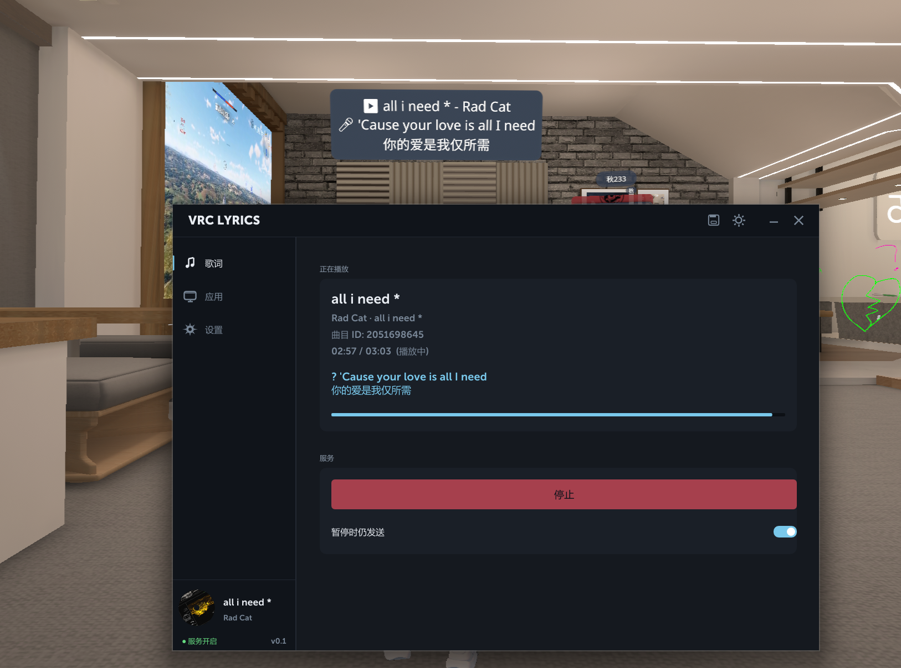
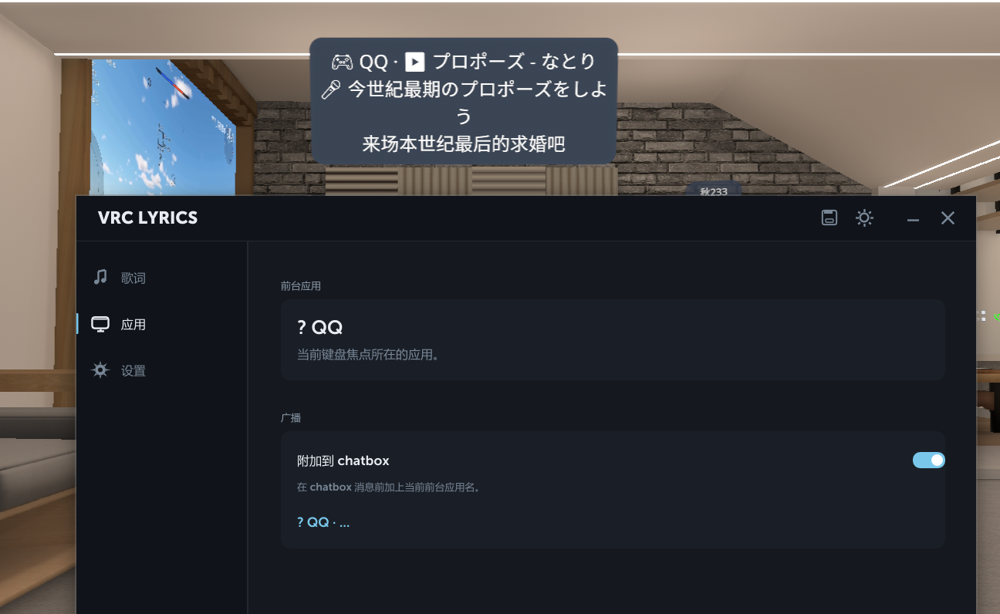

<div align="center">

# VRChat Lyrics

**网易云歌词 → VRChat chatbox 实时推送**

C++ + ImGui · Neverlose 风格界面 · 中英繁三语 · 暗亮主题

[](LICENSE)
[]()
[]()

</div>

---

## ✨ 特性

- 🎵 **自动读取网易云正在播放的歌**
  通过 BetterNCM 插件 [inflink-rs](https://github.com/apoint123/inflink-rs) 把网易云写到 Windows SMTC,我们再从 SMTC 拉播放状态(歌名/艺人/专辑/进度/封面/网易云歌曲 ID)。
- 📝 **同步歌词**
  直连网易云公开 API,带翻译可选合并,LRCLib 作 fallback。
- 🎤 **OSC 实时推送 VRChat chatbox**
  支持自定义模板,有速率限制不会触发 chatbox 风控。
- 🎮 **附加当前前台应用**
  打游戏时自动加上"🎮 VRChat · 🎵 ...",别人能看到你在干啥。
- 💿 **旋转专辑封面**
  CD 风格,播放时转、暂停停、切歌带淡入淡出动画。
- 🌗 **暗色 / 亮色主题一键切**
  300ms 平滑过渡,不闪眼。
- 🌐 **三语界面**:简体中文 / 繁體中文 / English,实时切换。
- 🔔 **系统托盘**,关窗后服务在后台继续跑。
- 💾 **设置持久化**到 `%APPDATA%\vrc-lyrics\config.json`。
- 🖱 **无边框 + DWM 阴影**,Neverlose 风格视觉。

## 📸 截图

> 上方 chatbox 是 VRChat 里别人能看到的实时歌词,下方是本程序界面。

<div align="center">
  
  <br><br>
  
</div>

## 🚀 快速开始

### 前置条件

1. **Windows 10/11**
2. **网易云音乐 + BetterNCM** ([安装教程](https://github.com/std-microblock/BetterNCM-Installer))
3. **inflink-rs 插件**(从 BetterNCM 插件商店搜索安装,或 [手动下载](https://github.com/apoint123/inflink-rs/releases))
4. **VRChat 启用 OSC**:Action Menu → Options → OSC → Enabled

### 跑起来

1. 从 [Releases](../../releases) 下载 `vrc-lyrics.exe`(或自己编译,见下)
2. 启动网易云,随便播一首歌
3. 双击 `vrc-lyrics.exe`,Home 应该立刻显示曲目信息和封面
4. 点 **Start**,VRChat chatbox 出现 "▶️ 歌名 - 艺人\n🎤 当前歌词"
5. 点关闭按钮藏到托盘,服务继续后台运行;托盘右键 Exit 才真退出

## 🔧 自己编译

### 环境

- Visual Studio Build Tools 2022(带 MSVC v143 + Windows SDK 10.0.22621 或更新)
- 不需要 CMake,直接用 `.vcxproj` + MSBuild

### 步骤

```powershell
# 1. 克隆本仓库
git clone https://github.com/Naven-reborn/VRChat-Lyrics.git
cd VRChat-Lyrics

# 2. 克隆 ImGui (docking 分支) 到 deps/imgui
git clone --branch docking --depth 1 https://github.com/ocornut/imgui.git deps/imgui

# 3. 编译
build.bat Release
# 或 Debug:
build.bat Debug
```

产物在 `out\Release\vrc-lyrics.exe`。

也可以直接 VS 打开 `vrc-lyrics.sln` F5 调试。

## 🧠 它怎么工作

```
┌─────────────────┐                                ┌──────────────────┐
│  网易云音乐      │ ──── inflink-rs 插件 ──→        │  Windows SMTC    │
└─────────────────┘                                └────────┬─────────┘
                                                            │  C++/WinRT 200ms 轮询
                                                            ↓
                                              ┌──────────────────────────┐
                                              │   playback::SmtcWatcher  │  歌名/艺人/进度/NCM-ID/封面字节
                                              └────────────┬─────────────┘
                                                           │ 切歌
                                       ┌───────────────────┴───────────────────┐
                                       ↓                                       ↓
                          ┌────────────────────────┐              ┌──────────────────────┐
                          │ lyrics::Service worker │              │  util::CreateCircular│
                          │ WinHTTP + nlohmann     │              │  Texture (WIC + D3D) │
                          │ music.163.com/api/...  │              └──────────┬───────────┘
                          └────────────┬───────────┘                         │
                                       ↓                                    ↓
                          ┌────────────────────────┐              ┌──────────────────────┐
                          │ FindCurrentLine 二分   │              │ ImDrawList 旋转 quad │
                          └────────────┬───────────┘              └──────────────────────┘
                                       ↓
                          ┌─────────────────────────┐
                          │  osc::Chatbox UDP 发送  │  /chatbox/input
                          └────────────┬────────────┘
                                       ↓
                          ┌─────────────────────────┐
                          │       VRChat            │
                          └─────────────────────────┘
```

## 📂 项目结构

```
src/
├── main.cpp                    # 进程入口 + 主循环
├── host/                       # Win32 窗口 / D3D11 / ImGui 接入 / 系统托盘
│   ├── win32_window.{h,cpp}    # 无边框 + WM_NCCALCSIZE + DWM 阴影
│   ├── d3d11_context.{h,cpp}
│   ├── imgui_host.{h,cpp}
│   └── tray.{h,cpp}            # Shell_NotifyIcon 封装
├── menu/                       # GUI
│   ├── menu.{h,cpp}            # 标签页 / 卡片 / 自定义控件
│   ├── style.{h,cpp}           # 调色板 + 主题切换动画
│   ├── MuseoSans700.h          # ⚠ 商业字体,公开发行请替换
│   └── MuseoSans900.h
├── playback/                   # SMTC 读取
│   ├── smtc.{h,cpp}            # C++/WinRT
│   └── track.h
├── lyrics/                     # 歌词
│   ├── netease.{h,cpp}         # music.163.com HTTPS GET
│   ├── lrclib.{h,cpp}          # fallback
│   ├── lrc_parser.{h,cpp}      # [mm:ss.xx] 解析
│   └── lyrics_service.{h,cpp}  # worker 线程 + 去重
├── osc/                        # VRChat OSC
│   ├── osc_message.{h,cpp}     # OSC 1.0 编码
│   └── chatbox.{h,cpp}         # UDP + rate limit + 去重
├── net/winhttp_client.{h,cpp}  # WinHTTP 同步 GET
├── util/
│   ├── image.{h,cpp}           # WIC 解码 + 圆形 alpha 蒙版 + D3D11 上传
│   └── foreground.{h,cpp}      # 前台应用名识别
├── config/config.{h,cpp}       # JSON 持久化
└── i18n/i18n.h                 # 三语 t(en, sc, tc)

deps/
├── imgui/                      # Dear ImGui (docking 分支,自己 clone)
└── json/json.hpp               # nlohmann/json 单头文件
```

## 🛠 技术栈

- **C++20**(MSVC v143)
- **Win32** 直接调,不依赖 MFC/WTL
- **D3D11** + **Dear ImGui** (docking 分支)渲染
- **C++/WinRT** 调 SMTC(`GlobalSystemMediaTransportControlsSessionManager`)
- **WinHTTP** + **nlohmann/json** 拉网易云歌词
- **WIC** 解码封面 JPEG/PNG
- **微软雅黑** 作 CJK fallback,主字体 MuseoSans
- **DWM** 阴影 + 直角窗口(关圆角)
- **DPI Per-Monitor V2** 感知

## ⚙ 配置

设置自动保存到 `%APPDATA%\vrc-lyrics\config.json`,字段:

| 字段 | 类型 | 说明 |
|------|------|------|
| `language` | 0/1/2 | EN / 简体 / 繁体 |
| `theme` | 0/1 | 暗 / 亮 |
| `osc_host` | string | 默认 127.0.0.1 |
| `osc_port` | int | 默认 9000(VRChat chatbox) |
| `rate_limit_ms` | int | OSC 速率限制,默认 1300 |
| `lyrics_provider` | 0/1/2 | 网易云仅 / 网易云→LRCLib / LRCLib 仅 |
| `include_translation` | bool | 合并 tlyric 翻译 |
| `show_foreground_app` | bool | chatbox 前缀加前台应用名 |
| `send_while_paused` | bool | 暂停时仍发送 |
| `fmt_lyrics`/`fmt_no_lyrics`/`fmt_paused` | string | chatbox 模板 |

## ⚠ 已知问题

- **部分 VIP / 试听受限歌曲**网易云不返回歌词,会显示"暂无歌词"。
- **MuseoSans 是商业字体**,本仓库附带的 TTF 字节数组仅供个人构建测试使用,**公开发布前请替换为开源字体**(如 Inter / Manrope,用 `binary_to_compressed_c.cpp` 转 .h)。
- 切歌瞬间偶尔会有 200ms 左右的歌词空窗(等 HTTP 请求返回),正常现象。
- 没装 inflink-rs 的话,SMTC 拿不到 NCM-ID,歌词模块拿不到 ID 就不工作。

## 🙏 鸣谢

- [**Neverlose**](https://github.com/jsopn) — GUI 视觉风格灵感
- [**BigAtomikku/VRC-Lyrics**](https://github.com/BigAtomikku/VRC-Lyrics) — 原 Python 项目,提供功能蓝本
- [**apoint123/inflink-rs**](https://github.com/apoint123/inflink-rs) — 让外部程序能读到网易云的关键桥梁
- [**ocornut/imgui**](https://github.com/ocornut/imgui) — Dear ImGui
- [**nlohmann/json**](https://github.com/nlohmann/json) — JSON for Modern C++

## 📜 License

MIT — 见 [LICENSE](LICENSE)。

字体 (`src/menu/MuseoSans*.h`) 不在 MIT 授权范围内,使用前请自行处理版权问题。
